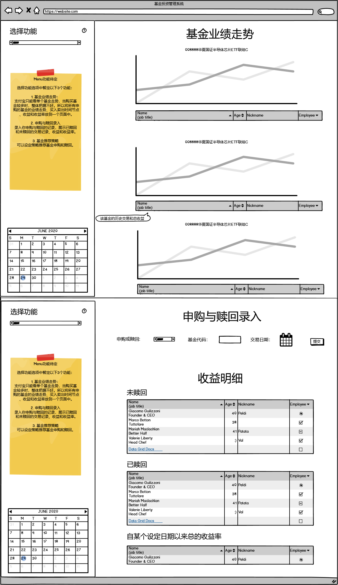

基金推荐与投资记录系统：如何成为一名合格的韭菜！

## 项目背景

基金相比于股票，收益要更加稳定，不需要过多专业知识且无需花自己大量的时间去盯盘，适合有一些闲钱却又不会投资的人进行投资。

今年2月份以来我开始投资基金，使用支付宝进行购买。

在投资的过程中，我发现了几个问题：

### 1. 持有成本明细不明确

**持有基金详情页**中只有基金的总的持有成本，昨日收益，持有收益，但是，在不同时期购入的基金的成本是不同的，点击**详情**可以查看业绩走势，但是没有具体的成本，购买记录，申购和赎回手续费。当你购买了好几个不同的基金，这需要你每次一个一个点进去看，这样不容易且不直观分析数据。

### 2. 挑选基金时不方便

支付宝没有一个很好的挑选基金的方法，对于购买基金的韭菜来说，讲的就是效率，不用讲什么技术，低买高卖就是王道。

### 3. 基金走势查看不方便

支付宝的基金走势需要你去一个个点进去看，当你购买的基金数量和种类较多时，查看很不方便。

## 项目方案

本项目拟解决上述三个问题，解决方案：

1. 设计一套基金投资记录系统，用于记录每次基金的投资明细，基于B/S架构，具有可视化和数据分析的功能。
2. 设计一个基金推荐系统，该系统采集和监控每天的基金数据，根据一定的策略，生成推荐的基金，推送到微信。

## 技术框架

1. 可视化系统使用Streamlit实现，该库是一个优秀的大数据分析和可视化库，之前在商业项目中使用过，效果不错。
2. 数据来源：设计爬虫爬取天天基金网的数据或者采用可以直接调用数据的库。
3. 数据库采用Sqlite，方便用户配置，可以做到开箱即用。
4. 微信推送采用【Server酱】的微信推送服务。
5. 部署环境：IBM 的CF服务可以免费注册使用，基金设置策略筛选模块我在本地已经测试了一个月，非常稳定。所有基金的历史数据到20200629日，共占用存储空间400多MB，IBM的免费套餐支持1GB的存储空间，应该可以支持长期使用。

## 项目结构

```bash
(base) ➜  Fund git:(master) tree .
.
|-- LICENSE
|-- Makefile
|-- README.md
|-- database_temp
|   `-- create_table.sql
|-- fund
|   |-- Procfile
|   |-- README.md
|   |-- __init__.py
|   |-- __pycache__
|   |   |-- funddata.cpython-38.pyc
|   |   `-- recommend.cpython-38.pyc
|   |-- fund.bat
|   |-- funddata.py
|   |-- main.py
|   |-- manifest.yml
|   |-- recommend.py
|   `-- requirements.txt
|-- images
|   `-- \351\241\271\347\233\256\350\215\211\347\250\27720200629.png
|-- requirements.txt
|-- setup.py
`-- tests
    `-- __init__.py
```
fund采用pypi package的封装结构，fund为库的名字，`funddata.py`为采集模块，采集天天基金的数据，并写入到api中，采集数据分为两部分，一部分是历史数据，一部分是增量数据。`recommend.py`模块为基金推荐模块，通过设置一定的策略，进行推荐策略。

## TODO
1. 增加几种常用的数据库支持：Mysql
2. 优化数据库表结构
3. 优化现有的根据阈值设置的量化策略指标
4. 增加量化策略指标策略，例如当前值占历史估值的百分位
5. 增加基金的实时估值的接口
6. 量化交易（预测），根据美股，A股历史数据，预测出未来基金的走势

## 更新日志：

#### 20200629：设计投资管理系统原型草稿



#### 20200722：IBM cloudfoundry配置更新，现在已经可以配置在IBM CF的免费服务上了，运行很稳定。

#### 20200724：IBM cloud foundry重启后数据库会丢失，盲猜IBM cf重启后会恢复你push上去的内容，有待进一步确认。